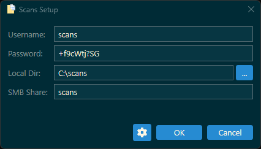
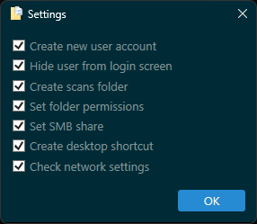
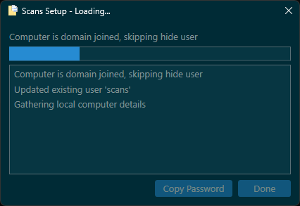
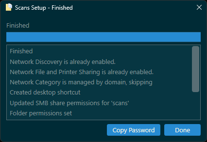

# **Scanning Setup Utility**

A lightweight PowerShell utility that configures a Windows PC for network scanning in one click. Creates a dedicated scan user, shared folder, firewall rules, and desktop shortcut — no manual setup required.

## Quick Start

Paste the following into an **Administrator** PowerShell window:

```powershell
irm https://raw.githubusercontent.com/mstrhakr/scans/main/scans.ps1 | iex
```

### Older Systems (Windows 7 / 8 / Server 2008 R2)

The one-liner above requires TLS 1.2 which older PowerShell versions don't enable by default. Use this two-line variant instead:

```powershell
[Net.ServicePointManager]::SecurityProtocol = [Net.SecurityProtocolType]::Tls12
irm https://raw.githubusercontent.com/mstrhakr/scans/main/scans.ps1 | iex
```

If `Invoke-RestMethod` is not available (PowerShell 2.0), download and run manually:

```powershell
$url = 'https://raw.githubusercontent.com/mstrhakr/scans/main/scans.ps1'
$out = "$env:TEMP\scans.ps1"
(New-Object Net.WebClient).DownloadFile($url, $out)
powershell -ExecutionPolicy Bypass -File $out
```

> **Note:** PowerShell 3.0 or later is required. Windows 7 SP1 ships with PowerShell 2.0 — install [Windows Management Framework 3.0+](https://www.microsoft.com/en-us/download/details.aspx?id=54616) first.

## Requirements

| Requirement | Details |
| --- | --- |
| **OS** | Windows 7 SP1 or later (including Server 2008 R2+) |
| **PowerShell** | 3.0+ |
| **Privileges** | Must be run as Administrator |
| **Network** | Internet access for first run (downloads application icon) |

## What It Does

This script completely sets up the user environment for quick scan-to-SMB:

- Creates or updates a dedicated scan user account (hidden from login screen)
- Creates the scan folder at **C:\scans** (configurable)
- Sets folder permissions for the scan user, current admin, and Everyone
- Shares the folder via SMB as **scans** (configurable)
- Creates a desktop shortcut to the scan folder
- Sets the network category to Private (non-domain PCs)
- Enables File and Printer Sharing firewall rules
- Enables Network Discovery firewall rules

All settings are configurable through the UI before execution.

## Usage

First choose the inputs — the password is randomly generated with a cryptographically secure generator.



Click the gear icon to enable/disable individual steps.



Wait for the utility to complete all changes.



When finished, copy the password and click Done.



## Features

- **Solarized theming** — auto-detects Windows light/dark mode, defaults to dark
- **Legacy OS support** — falls back to `net user`, `net share`, `netsh`, and `Get-WmiObject` on Windows 7/8
- **Error remediation** — inline tips for common failures (trust relationship, access denied, share in use)
- **Single file** — no dependencies, no installation, runs directly from GitHub
