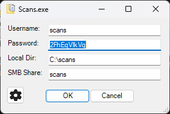
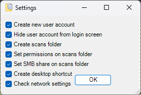
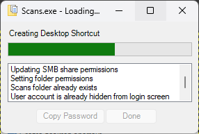
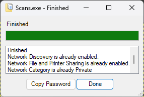

# **Scanning Setup Utility**
## The Basics

To run, paste the following into an admin powershell window.

``` powershell
irm https://raw.githubusercontent.com/mstrhakr/scans/main/scans.ps1 | iex
```

This script completely setups the user environment to allow a quick scan to SMB setup

This includes:
- Creating or updating the scans user account
- Creating the scans folder at **C:\scans** (by default)
- Setting local permissions for the scans folder
- Sharing the scans folder via SMB as ***scans*** (by default)
- Setting SMB permissions for the SMB share
- Creating a desktop shortcut to the scans folder
- Setting the Network Category to Private
- Enable File and Folder Sharing
- Enable Network Discovery

All you have to do is follow the prompts, it's as easy as that.

First choose the inputs, the password is randomly generated at 10 characters long.



Then if you want choose to disable any of the options on the settings page.



Then wait for the utility to complete all the required changes to your system.



When the utility is finished, click 'Done' to close the window.


